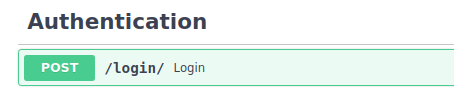

# Fast.Coach.API 📌
FastCoach is an attempt to build a  bus ticketing platform 

Old repo is [here](https://github.com/flavian-anselmo/fast-coach-api)


## Tools and Technology 👩‍💻
1. Backend 
    - FastApi
    - Python
    - PostgreSQL: storage 
    - Celery: used to create workers for the background tasks 
    - Flower: For monitoring background tasks 
    - RabbitMQ: A backend for the background tasks 

## Endpoints
### Users

### auth

### admin (Drivers, Buses & Routes)

### Book a ticket 

### payments (AfricasTalking API)


# How to install and Run 🏃‍♂️

```bash 

```
# How to run it with Docker🏃‍♂️

```bash

``` 
# Read the Docs 
## locally 
- [localhost:8000/docs](https://localhost:8000/dcos)
## deployed
- [somelink]()